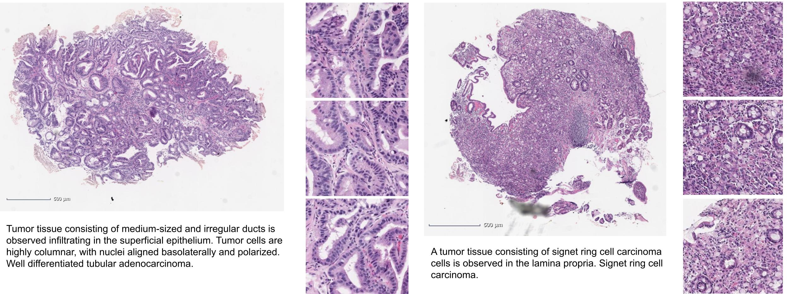

# histopathology image caption

A dataset of 262,777 patches extracted from 991 H&E-stained gastric slides with Adenocarcinoma subtypes paired with captions extracted from medical reports. For more details see [paper](https://openreview.net/forum?id=9gKn7SDb83v).


[captions.csv](captions.csv) contains `id,subtype,text` columns, where `id` designates the whole slide image id from which the patches were extracted. The patches filenames have `id` in the prefix as follows:  `{id}_{random hash}.jpg`. The patches can be downloaded from [here](https://zenodo.org/record/6021442).




Dataset is provided for research use only.

If you use this Dataset, please cite:

```
@misc{tsuneki2022inference,
      title={Inference of captions from histopathological patches}, 
      author={Masayuki Tsuneki and Fahdi Kanavati},
      year={2022},
      eprint={2202.03432},
      archivePrefix={arXiv},
      primaryClass={eess.IV}
}
```
